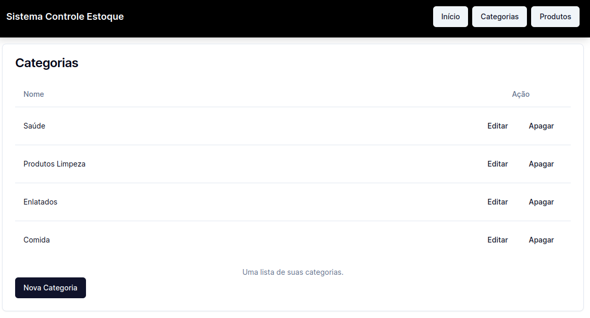
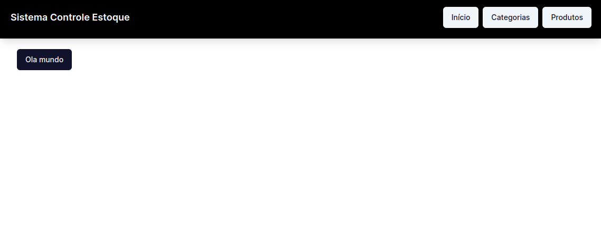
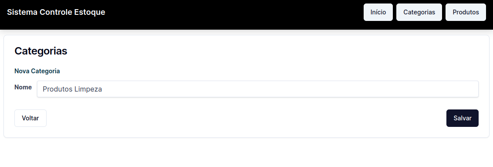
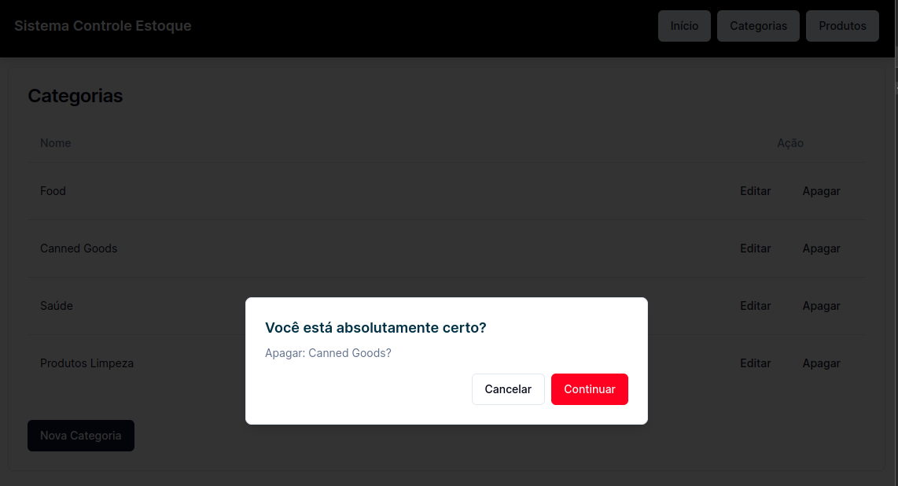

# O Sistema de Estoque

Esse projetoé um sistema de controle de estoque. O sistema contém as seguintes funcionalidades:
    . Cadastro de categorias
    . Alteração de uma categoria
    . Exclusão de uma categoria


O banco de dados usado, SQLite e o ORM Prisma.  É a forma mais fácil
de começar a trabalhar com dados em uma aplicação Next.

### Tela Inicial de Categorias



Primeiro, execute o servidor de desenvolvimento:

```json
npm run dev
# ou
yarn dev
```

Abra [http://localhost:3000](http://localhost:3000) com seu navegador para ver o resultado.






<h1 align="center">💻 Desenvolvido Por: Gilberto Júnior</h1>